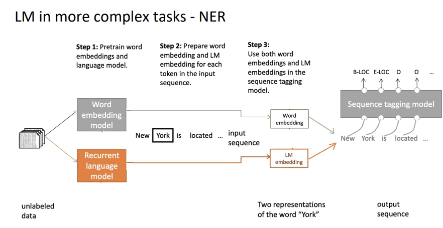

# CS6493 NLP

## Lecture 1 Introduction

### What is Natural Language Processing?

* A branch of Artificial Intelligence.

* Make computers to learn, process and manipulate natural languages to interact with humans.

### Bird’s-eye view of this course

* Basics: Linguistics, language models, word embeddings

* Tasks: NLU, NLG, machine translation, question answering, dialogue, text
  classification

* Large language models: Transformers, pretraining (e.g., BERT, GPT),
  prompting and alignment, LLM agent, efficient finetuning, RAG

### Why is NLP challenging?

- Ambiguity:
  
  - Similar strings mean different things, different strings mean the same thing.

- Context(上下文不同，word含义不同)

- Commonsense knowledge（根据常识知识所导致的不同结果，比方说，沙发搬不进去，因为太宽了(沙发)/太窄了(门框)）

### Preprocessing of data(NLP first step)

* Tokenization
  
  * Tokenization is the process of breaking up text document into individual words called tokens. 
  
  * Tokens can be either words, characters, or sub-words (oov, BPE).

* Stop words removal 

* Stemming(reducing a word to its stem/root word,但比较粗糙，可能难以保留有效单词，比方说“trouble”, “troubled” and “troubles” might actually be converted to troubl)

* Lemmatization(和stemming类似，但会保留有效单词，如上例，但是会根据词法还原成trouble)，常见调用库为WordNet，Parts of Speech(PoS) tagging(用于分类打标签，不太确定这个该分到哪里)

* Vectorization (N-gram, BOW, TF-IDF)
  
  * N-grams: 对一个有X个words的句子来说，会有X-N+1个grams
  
  * Bag of words
    
    * Intuition: two sentences are similar if they contain similar set of
      words.
    
    * 将文档涉及到的word切开来然后构建一个词汇表，随后进行One-hot
    
    * 缺点：Vector length = vocabulary size. Sparse metric with many 0s. Retain no grammar or ordering information.
  
  * TF-IDF
    
    * each text sentence is called a **document**，collection of such documents is referred to as **text corpus**.
    
    * reflect how important a word is to a document in a collection or corpus
    
    * Term Frequency: 衡量 term t出现在文档d的频率 TF=num t / sum of num of words in d
    
    * Inverse Document Frequency: IDF=log(总文档数/有t出现的文档数)
    
    * TF-IDF=TF*IDF

* Tokenization Methods
  
  * Word Tokenization,测试时可能会遇到词汇表不存在的新词，解决：选择训练数据中**前K个最频繁的单词**组成词汇表。将训练数据中的稀有词替换为**未知词元（UNK）**。但问题可能会激增
  
  * Character Tokenization，输入很大输出很大
  
  * Subword Tokenization(“lower” 分割为 “low-er”。)
  
  * BPE ,应用于Transformer
    
    1. 将语料库中的单词分割成字符，并在每个单词末尾添加</w>标记。
    
    2. 初始化词汇表，包含语料库中的所有唯一字符。
    
    3. 计算语料库中字符或字符序列对的频率。
    
    4. 将最频繁的字符对合并。
    
    5. 将合并后的最佳字符对保存到词汇表。
    
    6. 重复步骤3到5，迭代若干次。

## Lecture 2 Language Models

### Language model definition & applications

* infinite monkey theorem: 假设 一只猴子不断地敲键盘，总有可能敲出来有意义的话

* language model: **probability distribution** over sequences of words. length T,it assigns a probability 𝑃(𝑥(1), 𝑥(2), … 𝑥(𝑇)) to the wholesequence. 

* The task of language models could be regarded as **assigning probability to a piece of text**.

* It serves as a **benchmark** task that helps us to measure our progress on understanding language

* It is a **subcomponant** of many NLP tasks, especially those involving generating text and estimating the probability of the text

* LM的目的是预测下一个词是什么，所以我们考虑给一系列词x1,x2,...,xt,然后计算xt+1的概率分布p(xt+1|x1...xt)

* 马尔科夫假设了xt+1依赖于前n-1个单词，所以有我们刚刚看到的条件概率，该条件概率=P(n-gram)/P((n-1 )gram),可以近似地用频率近似概率

### Model construction

#### Statistical language models

* n-gram
  
  - Unigram:
  - Full history Model: 依赖于之前整个历史
  - 
  - 稀疏性问题中，分子中w可能不出现导致概率为0，分母中若不出现则导致无法计算，然后还有存储问题需要存储所有语料中的n-grams，所以增大语料也会增大模型大小
  - 
  - 对于分子我们可以添加一个小的δ来做一个平滑，对于分母我们可以进行回退到更小的分割。

#### Neural language models

* **固定窗口神经网络模型**
  
  * 
  
  * 首先是将输入的单词进行了独热编码，然后进行词嵌入的拼接，接着输入到了隐藏层进行处理，最后通过softmax函数转化为概率输出
  
  * 提升和仍存在的问题见图右

* **Recurrent Neural Network(RNN)**
  
  * Recurrent(循环) units: blocks share the structure and parameters (weights)
  
  * Flexible input / output size
  
  * Self-connections or connections to units in the previous layers
  
  * Short-term memory
  
  * 
  
  * 
  
  * RNN块，为图当中两个公式的具体表达，可以跟着走一遍，首先我们将这三个参数求和后用g1函数进行了处理得到了at，如果当前需要输出，我们则继续进行yt的计算。
  
  * 
  
  * 进行对比我们也可以看出这里的h是隐藏层的输出
  
  * 这里的tanh是一个激活函数，而我们这个激活函数可以当作一个soft switch(开关)，来控制信号流的强度，同时可以squash(压缩)值到固定范围，比如0，1
  
  * 
  
  * 此处最好对比记忆优点和之前的固定窗口NN
  
  * RNN的loss也是考虑了一个交叉熵损失，然后取平均，不过计算整个corpus的loss和gradient cost很高，所以我们这里采用了SGD(Stochastic Gradient Descent)来进行小块的进行更新loss和gradient。
  
  * 
  
  * How to calculate the derivatives of 𝐽(𝜃) with respect to the repeated weight matrix 𝑊ℎ through time 𝐽𝑡 (𝜃)? 通过链式法则来计算，同时运用了反向传播
  
  * 在RNN中，the loss function of all time steps is defined based on the loss at every time step, e.g., cross entropy loss. 然后反向传播计算梯度更新could increase/decrease exponentially with respect to the number of layers, leading to **ineffective weight updates**. 这就导致了**gradient vanishing/exploding**
  
  * 由于存在着这些问题，我们还是unable to predict similar long-distance dependencies at test time

* **Long Short-Term Memory**
  
  * a special RNN to slove vanish gradient
    phenomenon
  
  * it uses a set of gating units to control the
    memory.
  
  * 
  
  * 
  
  * LSTM有点复杂，然后又有了一个简化版的LSTM叫做GRU。
  
  * 
  
  * LSTM是如何解决梯度消失和long-term长期依赖的问题的？Maybe because of its gated design.
  
  * The LSTM architecture makes it easier for the RNN to preserve information over many timesteps
    ● e.g., if the forget gate is set to 1 for a cell dimension and the input gate set to
    0, then the information of that cell is preserved indefinitely.
    ● By contrast, it’s harder for traditional RNNs to learn a recurrent weight matrix
    𝑊ℎ that preserves info in hidden state.

### Language model evaluation

* **Perplexity**

* 
  
  * LSTM < RNN < n-gram

* Applying:
  
  * 
  * 
  * 
  * 

## Lecture 3 Word Embedding

### Word embedding definition and principles

* Meaning of words in human languages
  
  * the thing one intends to convey especially by language(说话的人想说的)
  
  * the thing that is conveyed by language(接收者所接收到的)
  
  * Denotational Semantics(语义学): Signifier(符号本身，譬如单词的拼写或者发音)<=> Signified(符号代表的具体事务或者抽象概念)

* **WordNet**(a lexical database of semantic relations between words in more than 200 languages): synonyms and hypernyms(同义词和近义词)
  
  * **Problems**:
    
    * Missing **nuance**(意义). Is “proficient” always a synonym of “good”?
    
    * Impossible to keep up-to-date
    
    * Subjective 主观
    
    * **Human labor** for creation and adaptation
    
    * Cannot compute accurate word **similarity**

* **One-hot vecto**r: discrete symbols
  
  * A localist representation
  
  * One-hot vectors
    ○ one 1, the rest 0
  
  * Vector diemension = number of words in vocabulary
  
  * **Problems**: There’s no natural notation for one-hot vectors!
  
  * **Solution** :Learn to **encode similarity**(Distributional hypothesis) in the vectors themselves.

* Distributional hypothesis:
  
  * Words that occur in **similar contexts** tend to have **similar meanings**
  
  * When a word w appears in a text, its **context** is the set of words that appear nearby (with a fixed-size window) Use many contexts of w to build up a representation of w

### Embedding methods – word2vec

#### Continuous bag-of-words

* Word embeddings - goal
  
  * Build a dense vector for each word
  
  * A word vector should be **similar** to vectors of words that appear in similar contexts
  
  * Word embeddings also called word vectors or (neural) word representation
  
  * A distributed representation

* Word2vec
  
  * Word2vec (Mikolov et al. 2013) is a framework for learning word vectors.
  
  * Idea:
    
    * Input: Given a large corpus of text (e.g., a bunch of sentences or documents)
    
    * Output: Every word in a fixed vocabulary is represented by a vector
    
    * Go through each position t in the text, which has a target word (or center word) 𝑤𝑡 and several context words 𝑤𝑐
    
    * Use the **similarity** **of the word vectors** for 𝑤𝑡 and 𝑤𝑐
      ○ **Skip-gram**: to calculate the probability of context words 𝑤𝑐 given the target word 𝑤𝑡
      ○ **Continuous bag of words (CBOW)**: to calculate the probability of target word 𝑤𝑡 given context words 𝑤𝑐
    
    * **Keep adjusting the word vectors** to maximize the probability
  
  * 

#### Skip-gram

* 
* 
* 
  * Hidden layer weight matrix = word vector lookup(查找)
  * Output layer weight matrix = weighted sum as final score. $S_j=hv_{w_j}'$ 最后的概率用softmax来输出
  * 
  * 随后给出了目标此的损失函数，然后写出来反向传播的公式推导，随后使用SGD来进行更新

### Improve training efficiency

* Reason:
  
  * The size of vocabulary V is impressively large
  
  * Evaluation of the objective function would take O(V) time

* Solution:
  
  * 负采样
  
  * 层次softmax

* Comparison:
  
  * Hierarchical softmax tends to be better for **infrequent words**.
  
  * Negative sampling works better for **frequent words and lower dimensional vectors**

#### Negative sampling

* A simplified version of NCE (Noise Contrastive Estimation) 
  
  * Sample from a **noise distribution** 𝑃𝑛(𝑤) 
  
  * The probabilities in 𝑃𝑛(𝑤) match the ordering of the frequency in the vocabulary 
  
  * Pick out k words from 𝑃𝑛(𝑤), training together with the center word
  
  * Convert to (k+1) **binary classification problems** 
  
  * e.g., in tensorflow, the probability distribution to select samples: (decreasing in s(w))

* Process:
  
  * Target word 𝑤𝑖 and context word 𝑤𝑗
  
  * From 𝑃𝑛(𝑤), based on a certain probability distribution, pick out k words 𝑤1, 𝑤2, … , 𝑤𝑘
  
  * Positive sample: {𝑤𝑖, 𝑤𝑗}
  
  * Negative samples: {𝑤𝑖, 𝑤1}, … ,{𝑤𝑖, 𝑤𝑘}
  
  * Then given 𝑤𝑖, predict the occurrence of 𝑤𝑗 using binary classifications:
    ○ 𝑤𝑖 co-occurs with 𝑤𝑗: truth label 1
    ○ 𝑤𝑖 does not co-occur with any 𝑤𝑘′ (1 ≤ 𝑘' ≤ 𝑘): truth label 0
  
  * 
  
  * 类比一下
    
    - 想象你在学习“苹果”这个词的语义（词向量）。
    - 正样本：你知道“苹果”和“水果”经常一起出现（上下文相关）。
    - 负样本：你随机抽取一些不相关的词（如“汽车”“桌子”），明确它们与“苹果”不相关。
    - 通过二分类，模型学习到“苹果”与“水果”更接近，与“汽车”“桌子”更疏远。
  
  * 公式推导个人觉得考的可能性不是很大，当然学霸随意推。

#### Hierarchical softmax

Huffman tree: the binary tree with minimal external path weight

* Construct a **Huffman tree**, with each leaf node representing a word
  
  * Each **internal node (a cluster of similar words)** of the graph (except the root and the leaves) is associated to a **vector** that the model is going to learn.
  
  * The probability of a word w given a vector 𝑤𝑖, **𝑃(𝑤|𝑤𝑖)**, is equal to the probability of **a random walk** starting at the **root** and ending at the leaf node corresponding to **w**.
  
  * Complexity: **O(log(V))**, corresponding to the length of the path.

* Construct a Huffman tree: merge two nodes with the minimum frequencies and consider them together as a single node; repeat until there is only one node

* 应该会考一道计算

* 假设词汇表有4个词：{“the”, “cat”, “dog”, “bird”}，词频分别为 {100, 50, 30, 20}

* 根
  
     /   \
   the  n1
  
         /  \
       cat  n2
             /  \
           dog  bird

* - 目标词 w2​=dog，上下文词 wi​。
  
  - 路径：根 → n1​（右）→ n2​（左）→ dog。
  
  - 路径节点：n(w2​,1)=根,n(w2​,2)=n1​,n(w2​,3)=n2​,n(w2​,4)=dog。
  
  - 路径长度：L(w2​)=4，有 L(w2​)−1=3 条边。
  
  - **假设**
  
  - ch(n) 总是左子节点。
  
  - 路径方向：
    
    - 从根到 n1​: 右（非 ch(n)，[x]=−1）。
    - 从 n1​ 到 n2​: 左（是 ch(n1​)，[x]=1）。
    - 从 n2​ 到 dog: 左（是 ch(n2​)，[x]=1）。
  
  - #### 概率计算：
    
    $P(w2​∣wi​)=P(n(w2​,1),right)⋅P(n(w2​,2),left)⋅P(n(w2​,3),left)$
    
    - 第1步（根 → n1​，右）： $P(n(w2​,1),right)=σ(−vn(w2​,1)T​vwi​​)=σ(−v根T​vwi​​)$
    
    - 第2步（n1​ → n2​，左）： $P(n(w2​,2),left)=σ(vn(w2​,2)T​vwi​​)=σ(vn1​T​vwi​​)$
    
    - 第3步（n2​ → dog，左）： $P(n(w2​,3),left)=σ(vn(w2​,3)T​vwi​​)=σ(vn2​T​vwi​​)$
    
    - 总概率： $P(w2​∣wi​)=σ(−v根T​vwi​​)⋅σ(vn1​T​vwi​​)⋅σ(vn2​T​vwi​​)$
    * 想象你在迷宫中找一本书（词 𝑤），迷宫是霍夫曼树。每次到达一个路口（内部节点），你回答“是/否”（左或右），最终到达目标书。高频书（常用词）放在靠近入口的地方，路径短；稀有书放得远，路径长。模型学习如何在每个路口做出正确选择（优化向量），使到达目标书的概率最大。
    
    * ● Minimize negative log likelihood − log 𝑃(𝑤|𝑤𝑖)
      ● **Update the vectors** of the nodes in the binary tree that are in the path from root to leaf node
      ● **Speed** of this method is determined by the way in which the binary **tree is constructed** and **words are assigned** to leaf nodes
      ● Huffman tree assigns **frequent words shorter** paths in the tree

### Other word embedding methods

#### GloVe

* Global Vectors for Word Representation
  ○ Global statistics (LSA) + local context window (word2vec)
  ○ Co-occurrence matrix, decreasing weighting: decay 𝑋𝑖𝑗=1/d (distance of word pairs)

* RNNs can be bi-directional

* Stacked RNNs
  ● RNNs can be stacked.
  ● For each input, multiple representations (hidden states) can be learned.

### Contextualized word embeddings (ELMo)

* Problems with (non-contextual) embeddings：
  
  * 对于多义词，非上下文嵌入生成的单一向量无法区分不同含义

* Contextualized embeddings:
  
  * ELMo: Deep contextualized word representations
  
  * From **context independent embeddings** to **context dependent embeddings**
  
  * ● In ELMo’s design, the embedding of one word could have multiple possible answers.
    ● The model only gives a certain embedding for one word when this word is given in a sentence.
  
  * **E**mbeddings from **L**anguage **Mo**dels(uses a bi-directional LSTM to pre-train the language model)

* **Key features**
  
  * Replace static embeddings (lexicon lookup) with **context-dependent** embeddings (produced by a deep neural language model), i.e., each token’s representation is **a function of the entire input sentence.**
  
  * Computed by a deep **multi-layer, bidirectional** language model.
  
  * Return for each token a (task-dependent) linear combination of its representation across layers.
  
  * Different layers capture different information.

* Architecture: 
  
  * First layer: character level CNN to get context independent embeddings.
  
  * Each layer of this language model network computes a vector representation for each token.
  
  * Freeze the parameters of the language model.
  
  * For each task: train task-dependent softmax weights to combine the layer-wise representations into a single vector for each token jointly with a task-specific model that uses those vectors.

* 

* 

## Lecture 4 Transformers &Pretraining-finetuning

### Attention

* Problems with contextualized word embeddings
  
  * RNNs/LSTMs have long-term dependency problems, where words/tokens are processed sequentially.
    o Information loss
    o Hard to compute in parallel

* Bi-directional RNNs/LSTMs feature fusion and representation ability is weak (compared with transformers).

* Why Attention?
  
  * To reduce the computational **complexity**.
  
  * To **parallelize** the computation.
  
  * Self-attention connects all positions in a sequence with a constant number of operations to solve the **long-term dependency** problem.
    ○ Self-attention could yield more **interpretable** models

* What is Attention?
  
  * An analogy to human’s brain, to pay more attention to more important information.
  
  * Map a **query** and a set of **key-value pairs** to an output, where the query, keys, values and output are all vectors. 
  
  * The output is a **weighted sum of the values**, where the weight assigned to each value is computed by a compatibility function of the query with the corresponding key

* Attention in NLP: aligning while translating

* Attention: formal description
  
  * Given a query vector 𝒒, and a set of key-value pairs (all vectors) {(𝒌i,vi)}i=1 to L, we first calculate the **similarity/attention score** between the query and each key: 𝑠i = 𝑠𝑖𝑚𝑖𝑙𝑎𝑟𝑖𝑡𝑦 (𝒒, 𝒌i)
  
  * Normalize the similarity score to be between 0 and 1, and they sum up to 1. These are called **attention distribution**. One way is to use the softmax operation.
    𝑎i = 𝑠𝑜𝑓𝑡𝑚𝑎𝑥(𝑠i) =exp(si)/ΣiLexp(si) 
  
  * Compute the **attention/context vector** 𝒛 as a weighted sum of values.z=ΣiL aivi
  
  * Keys and values are not necessarily the same, and they could be different as well, such as in machine translations.
  
  * 
  
  * 

* Attention is all you need: self-attention
  
  * For an input sequence of words, play attention mechanisms between every word and others (including itself).
  
  * Features
    o Constant path length between any two positions
    o Easy to parallelize per layer
  
  * 
  
  *   
  
  * 
  
  * 
  
  * How to combine multi-headed output together ?Concatenate them and use another linear transformation.
  
  * 
  
  * Graphical view and mathematical presentations
    o Linearly project the queries, keys and values ℎ times with different, learned linear projections to 𝑑k, 𝑑k, 𝑑v dimensions respectively.
    o On each of these projected versions, perform the attention function in parallel.
    o The resulting 𝑑v - dimensional output values are concatenated and once again projected.
  
  * Parameters: hidden size 𝑑model, self-attention heads ℎ

### Transformer

* Main technique: multi-head self attention mechanism.

* The transformer is a novel architecture that aims to solve sequence-to-sequence tasks while handling long range dependencies with ease.

* 

* 

### BERT

### GPT
